## About The Project
A task management system where users can create both personal and team tasks. It also includes a dashboard that displays your work progress for easy tracking. Additionally,  users can chat with each other and create rooms for projects to share tasks collaboratively.

- Built with Elysia and AngularJS (first-time experience)

### 🛠 Tech Stack
- Backend: [Elysia](https://elysiajs.com/)
- Frontend: [AngularJS](https://angularjs.org/)
- Database: [PostgreSQL](https://www.postgresql.org/)
- Others: [Docker](https://www.docker.com/)


## Task Mate
### Login
<p align="center">
  
  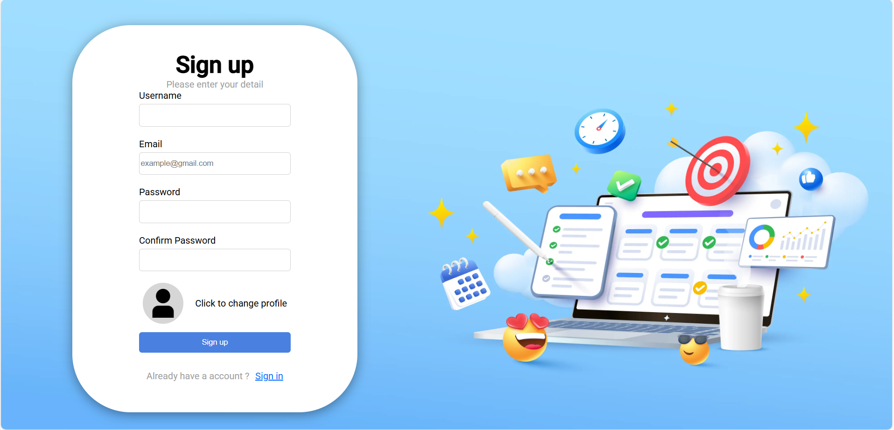
</p>

#### ✨ Features
- Can select your own profile
- Implement JWT authentication with cookie validation for protected routes

### Dashboard Page
<p align="center">
  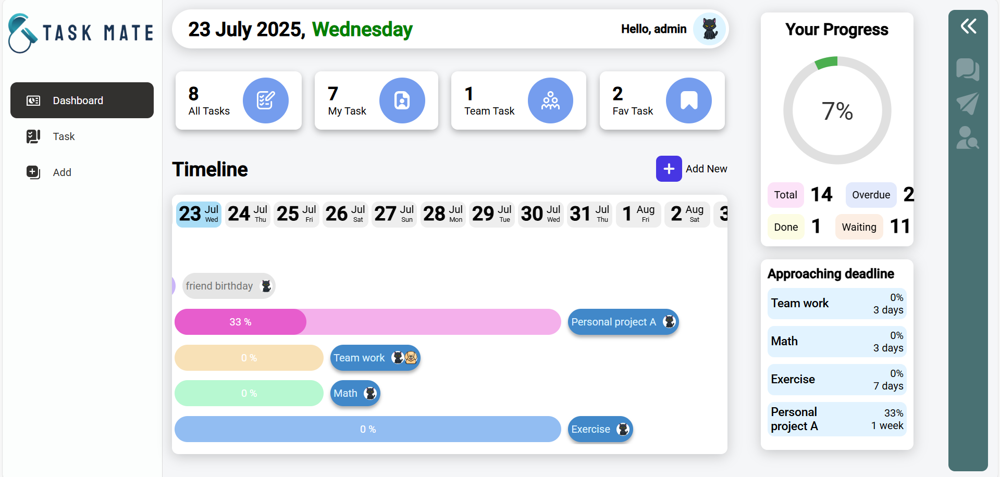
</p>
<p align="center">
  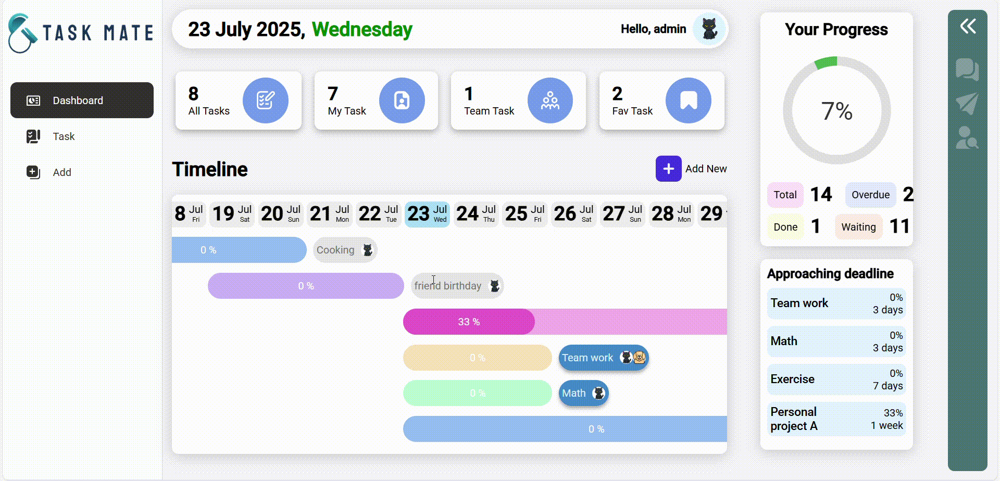
</p>

#### ✨ Features
- Display all tasks and your progress
- Show upcoming deadlines
- Show all task start and deadline dates through a graph

### Task Page
<p align="center">
  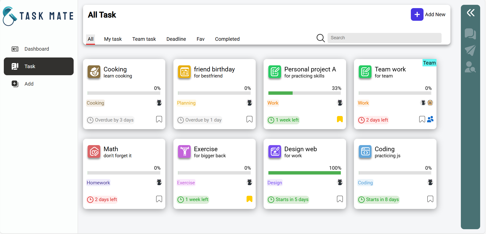
</p>
<p align="center">
  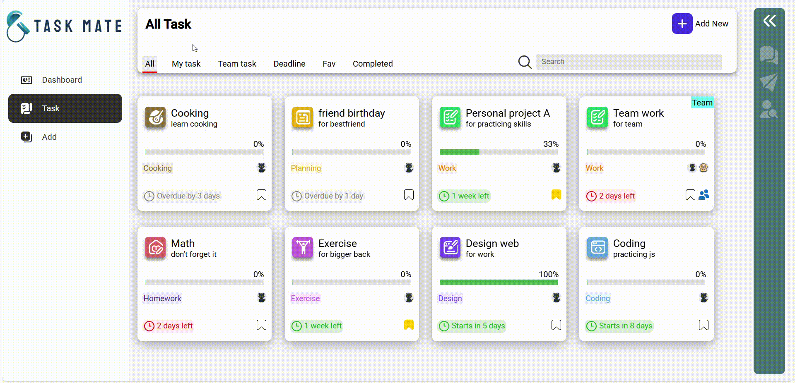
</p>
<p align="center">
  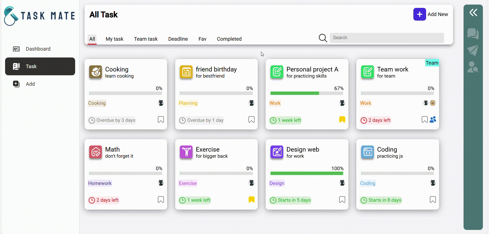
</p>
<p align="center">
  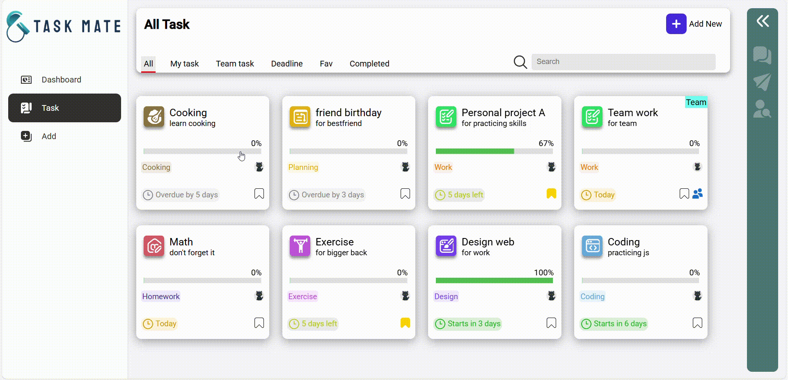
</p>

#### ✨ Features
- Show all tasks
- Search for tasks by name

### Add Task Page
<p align="center">
  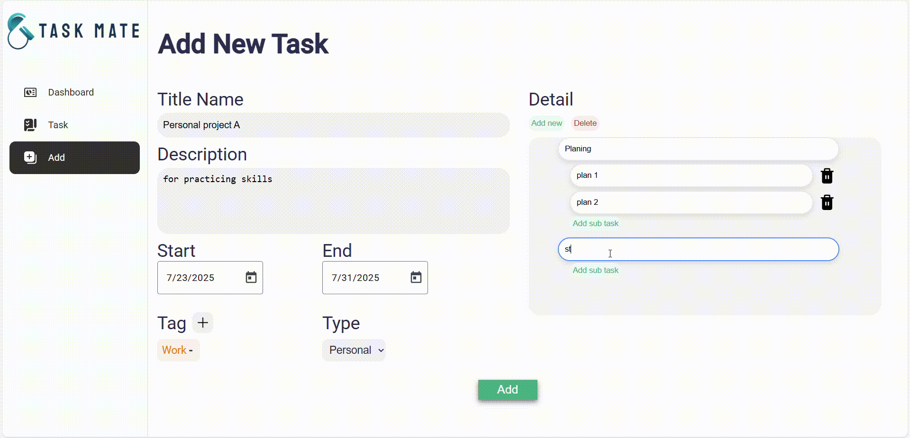
</p>

#### ✨ Features
- Add a new task

### Chat
<p align="center">
  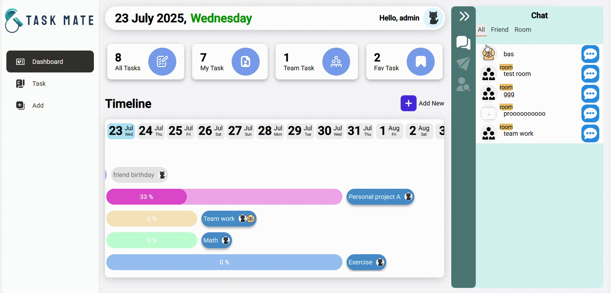
</p>

<p align="center">
  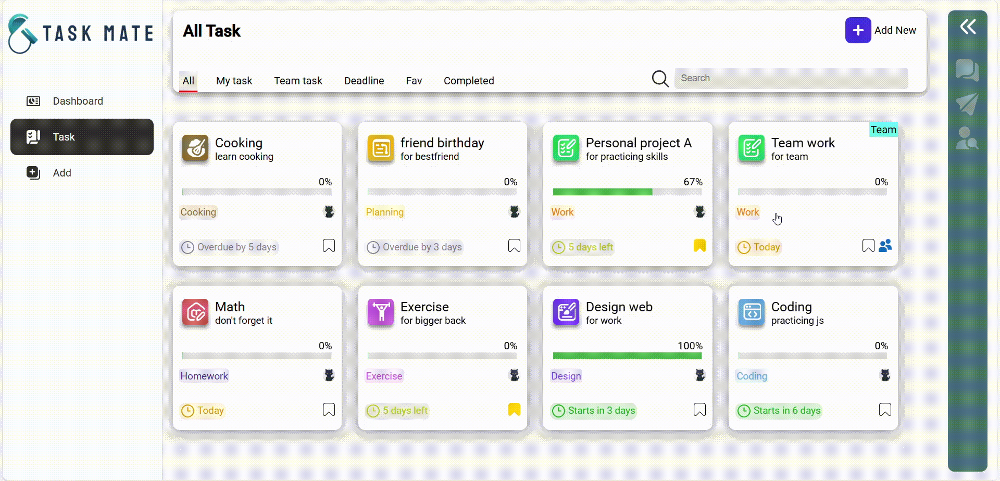
</p>

#### ✨ Features
- Chat with your friends
- Create rooms for managing team tasks

### Schema
<p align="center">
  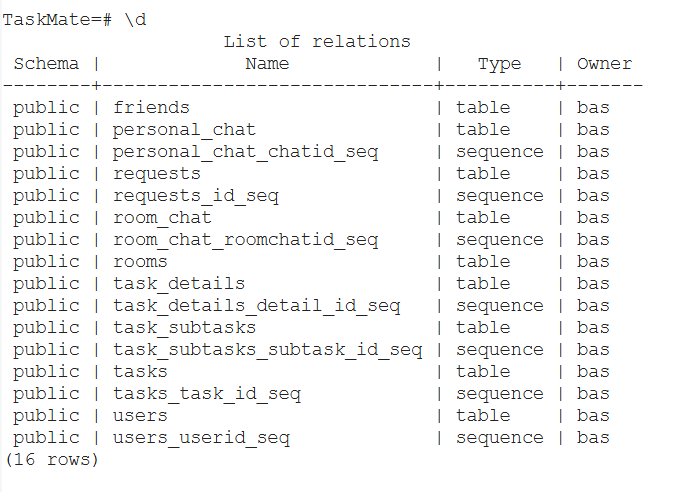
</p>

## 🚀 Getting Started
#### Using Docker Compose
 ```sh 
 git clone https://github.com/Pachara2103/TaskMate.git 
 ```
  ```sh 
 cd TaskMate
 ```
  ```sh 
 docker compose up -d
 ```
#### available at http://localhost:4200/


### Improvements
- เพิ่มการยืนยันตัวตน during request เพื่อความปลอดภัยของระบบ
- design database ให้ดีกว่านี้
- วางโครงสร้างใน frontend, backend ให้ดีขึ้น

### Contact
- Gmail: patcharaauikim3800@gmail.com


